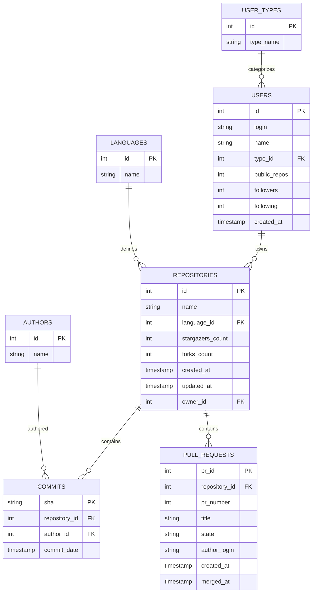

# GitHub Projects Insights: AI-Powered Academic Project Monitoring

A high-performance Data Engineering pipeline designed to help **Mentors and Guides** track student project progress by extracting data from GitHub, normalizing it in **Snowflake**, and applying **AI models** to detect fatigue and project momentum.

## 🚀 Overview
This project provides a comprehensive overview of student activity across hundreds of repositories. It uses advanced analytics to turn raw git metadata into actionable insights for academic evaluation (300-mark college projects).

## 🏗 Architecture & Workflow

### 1. Data Extraction (Python)
The `main.py` orchestrator performs a deep-crawl of the GitHub API.
- **Resumable ETL**: Automatically resumes from the last processed user if interrupted.
- **Incremental Saving**: Saves progress after every user to prevent data loss.
- **Rich Data Scope**: Extracts Profiles, Repositories, Commits (limit 100/repo), and Pull Requests (limit 50/repo).

### 2. Complex Normalization (7 Tables)
The `normalize_data.py` script transforms nested JSON into a relational structure ready for **Snowflake**.

#### 📊 Database Schema (ER Diagram)


- **Schema Tables**:
  - `USER_TYPES`: Categorizes accounts (User vs Organization).
  - `USERS`: Detailed contributor profiles.
  - `LANGUAGES`: Unique programming languages across all repos.
  - `REPOSITORIES`: Metadata for 12,000+ repositories.
  - `AUTHORS`: Unique Git authors across 500k+ commits.
  - `COMMITS`: Transactional commit history.
  - `PULL_REQUESTS`: Full lifecycle tracking (Open/Closed/Merged).

### 3. Automated Cloud Data Warehousing
The `load_to_snowflake.py` script automatically creates the DDL schema and pushes all 500,000+ extracted rows into a live Snowflake cloud database using secure Python connectors.

### 4. Machine Learning for Academic Monitoring (`ml/`)
We utilize the Snowflake data to train predictive Python models that provide actionable insights to Mentors:
1. **Student Fatigue Predictor:** An Isolation Forest model that flags students at risk of overwork based on late-night and weekend commit patterns.
2. **Submission Timeline Predictor:** A Random Forest Regressor that predicts how long it takes for a student's submission (PR) to be reviewed.
3. **Project Progress Scorer:** A K-Means clustering algorithm that grades projects from A (Excellent Progress) to F (Stalled) based on activity and consistency.

### 5. Mentor Dashboard (`dashboard/`)
A live **Streamlit** application designed for Guides to monitor student progress, check fatigue alerts, and view strategic project insights.

### 📊 Power BI Visualization
The final step of the pipeline is data visualization using **Power BI**. 

### 1. Connecting to Snowflake
1.  **Open Power BI Desktop**.
2.  Click on **Get Data** > **Database** > **Snowflake**.
3.  **Server**: Enter your Snowflake account URL.
4.  **Warehouse**: Specify your Snowflake warehouse name (e.g., `COMPUTE_WH`).
5.  **Authentication**: Select **Database** and enter your Snowflake credentials.
6.  **Navigator**: Select the tables created by `snowflake_ddl.sql` (USERS, REPOSITORIES, COMMITS, etc.).

### 2. Data Modeling & DAX Measures
Create a **Star Schema** in the Model view and add these key measures:
- **Total Repositories**: `COUNTROWS('REPOSITORIES')`
- **Avg Stars per Repo**: `AVERAGE('REPOSITORIES'[STAR_COUNT])`
- **Total Commits**: `COUNTROWS('COMMITS')`
- **Total Contributors**: `DISTINCTCOUNT('COMMITS'[AUTHOR_ID])`

### 3. Suggested Insights
| Metric | Suggested Visual |
| :--- | :--- |
| **Top Languages by Star Count** | Treemap or Bar Chart |
| **Commits Over Time** | Line Chart or Area Chart |
| **Language Popularity** | Pie Chart or Donut Chart |
| **Repository Size vs Stars** | Scatter Plot |
| **Contributor Activity** | Clustered Column Chart |

### 3. Snowflake Integration
The project includes a ready-to-use **`snowflake_ddl.sql`** script to set up your cloud data warehouse in seconds.

## 🛠 Setup & Usage

### Prerequisites
- Python 3.8+
- GitHub Personal Access Token (PAT)
- Snowflake Account

### Installation
1. Install dependencies:
   ```bash
   pip install -r requirements.txt
   ```
2. Configure your `.env` file:
   ```env
   GITHUB_TOKEN=your_token_here
   ```

### Running the Pipeline
1. **Extract Raw Data**:
   ```bash
   python main.py
   ```
2. **Normalize for Snowflake**:
   ```bash
   python normalize_data.py
   ```
3. **Load to Snowflake**:
   ```bash
   python load_to_snowflake.py
   ```
   *(Ensure `SNOWFLAKE_USER`, `SNOWFLAKE_ACCOUNT`, and `SNOWFLAKE_PASSWORD` are set in your `.env`)*
4. **Train the Machine Learning Suite**:
   ```bash
   cd ml
   python train_suite.py
   cd ..
   ```

5. **Launch the Analytics Web Dashboard**:
   ```bash
   cd dashboard
   streamlit run app.py
   ```
## 📁 Project Structure
- `main.py`: The GitHub API ETL Orchestrator.
- `normalize_data.py`: The Transformation Engine.
- `load_to_snowflake.py`: Automated Cloud Database uploader.
- `ml/`: Enterprise Machine Learning Models (Burnout, PRs, Repo Health).
- `dashboard/`: Streamlit Web Application for ML Visualization.
- `pipeline/`: Core GitHub API client package.
- `snowflake_ddl.sql`: Snowflake table definitions.
- `config.py`: Global settings and file paths.

---
**Monitor and guide your students effectively with GitHub Projects Insights!**
